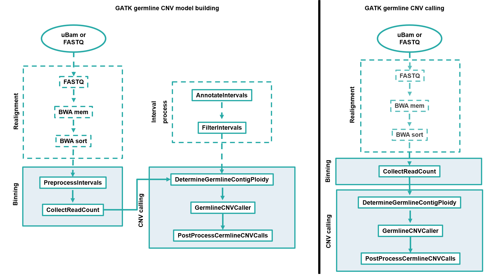

# Germline Copy Number Variation detection pipeline

## Introduction

This is a pipeline based on the GATK workflow to detect germline CNV in a WGS or WES data.
It is constituted by 2 parts, and so it is divided in 2 different nextflow files: GATK_CNV_COHORT.nf and GATK_CNV_CASE.nf. The first file refers to the construction of a model to be used as a reference (a model is optimally made out from as many 'normal' samples as possible to statistically determine what constitutes as a CNV variant or not in the tested sample), and the second one to the detection itself of CNV variants in a sample.

# 

Summarized information from each process is commented inside the pipeline. To get more insight, you can go to the [`GATK website`](https://gatk.broadinstitute.org/hc/en-us/articles/360035531152--How-to-Call-common-and-rare-germline-copy-number-variants).

## Quick Start

i. Install [`Nextflow`](https://nf-co.re/usage/installation)

ii. Install [`Singularity`](https://www.sylabs.io/guides/3.0/user-guide/)

iii. Download GATK container from DockerHub:

```bash
singularity build --sandbox gatk_4.1.3.0/ docker://broadinstitute/gatk
```

iv. Run pipeline with a config file, which determines input/output files path and other metadata

```bash
nextflow run GATK_CNV_COHORT.nf -c cohort.config
nextflow run GATK_CNV_CASE.nf -c case.config
```

## Credits

nibscbioinformatics/core/workflows/GATK was originally written by Pedro Raposo.
