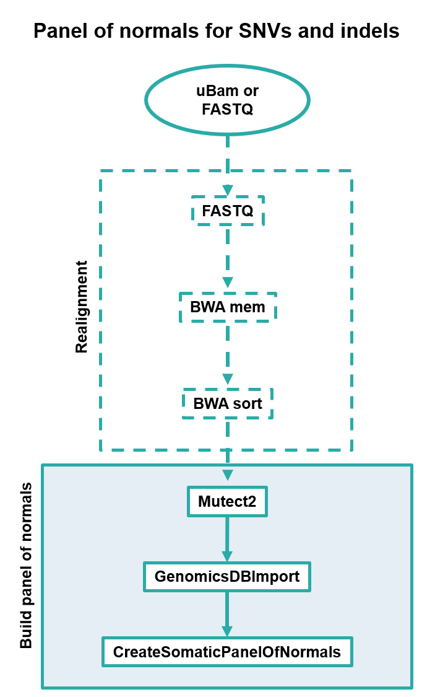

# Panel of Normals construction for variant calling

## Introduction

This is a pipeline based on the GATK workflow to create a Panel of Normals (PON) for WGS or WES data.
This PON is built to be used as a reference (optimally made out from as many 'normal' samples as possible to statistically determine what constitutes as a SNP variant or not in the tested sample) to be used against the [`variant calling pipeline`](https://github.com/nibscbioinformatics/core/blob/master/workflows/human-WGS).

# 

Summarized information from each process is commented inside the pipeline. To get more insight, you can go to the [`GATK website`](https://gatk.broadinstitute.org/hc/en-us/articles/360035531132--How-to-Call-somatic-mutations-using-GATK4-Mutect2).

## Quick Start

i. Install [`Nextflow`](https://nf-co.re/usage/installation)

ii. Run pipeline with a config file, which determines input/output files path and other metadata

```bash
nextflow run build_pon.nf -c nextflow.config
```

## Credits

nibscbioinformatics/core/workflows/GATK was originally written by Thomas Bleazard.